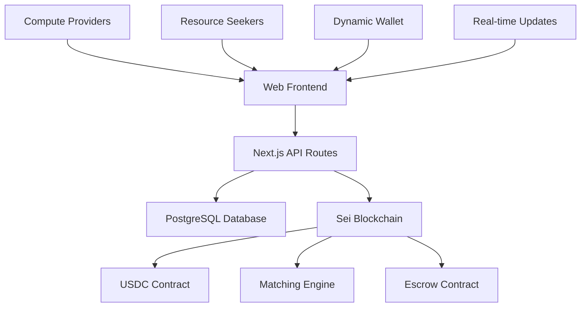

# 🚀 NodeNexus: Decentralized Compute Marketplace

<div align="center">
  
  [](https://sei.io)
  [](https://nextjs.org)
  [](https://www.typescriptlang.org)
  [](https://tailwindcss.com)
  [](./LICENSE)
</div>

## 🌟 Overview

NodeNexus is a decentralized marketplace that connects compute resource providers with enterprise workloads through intelligent matching algorithms and automated payment systems. Built natively on the Sei blockchain, NodeNexus leverages Sei's sub-400ms finality to enable real-time compute resource allocation at machine speed.

### ✨ Key Features

- **⚡ Lightning-Fast Matching**: Sub-400ms resource allocation using Sei's high-performance consensus
- **💰 Automated USDC Payments**: Secure escrow-based payment system with automatic release
- **🔒 Enterprise Security**: Military-grade encryption and multi-signature wallet support
- **🌐 Global Network**: Decentralized infrastructure spanning 50+ countries
- **📊 Real-time Analytics**: Live market statistics and performance monitoring
- **🔧 Developer APIs**: RESTful and GraphQL endpoints for seamless integration

## 🏗️ Architecture



## 🛠️ Tech Stack

### Frontend
- **Framework**: Next.js 15 with App Router
- **UI Library**: React 19 with Server Components
- **Styling**: Tailwind CSS 4 with custom design system
- **State Management**: React Context + Custom hooks
- **Web3 Integration**: Dynamic Labs, Wagmi, Viem

### Backend
- **Runtime**: Node.js with TypeScript
- **Database**: PostgreSQL with Prisma ORM
- **Authentication**: Dynamic Labs Web3 Auth
- **API**: RESTful endpoints with OpenAPI spec
- **Caching**: In-memory caching for performance

### Blockchain
- **Network**: Sei EVM (Chain ID: 1329)
- **Payment Token**: USDC on Sei
- **Wallet Support**: MetaMask, WalletConnect, Coinbase Wallet
- **Smart Contracts**: Solidity contracts for escrow and matching

## 🚀 Quick Start

### Prerequisites

- **Node.js**: v20.0.0 or higher
- **npm**: v9.0.0 or higher
- **PostgreSQL**: v14.0 or higher
- **Git**: Latest version

### Installation

1. **Clone the repository**
   ```bash
   git clone https://github.com/monday436326/node-nexus.git
   cd nodenexus
   ```

2. **Install dependencies**
   ```bash
   npm install
   ```

3. **Environment setup**
   ```bash
   cp .env.example .env.local
   ```
   
   Update the environment variables:
   ```env
   # Database
   DATABASE_URL="your-postgresql-connection-string"
   
   # Dynamic Labs (Web3 Auth)
   NEXT_PUBLIC_DYNAMIC_ENVIRONMENT_ID="your-dynamic-env-id"
   
   # Sei Network
   NEXT_PUBLIC_SEI_RPC_URL="https://evm-rpc.sei-apis.com"
   NEXT_PUBLIC_USDC_CONTRACT_ADDRESS="0x..."
   ```

4. **Database setup**
   ```bash
   npx prisma db push
   npx prisma generate
   ```

5. **Start development server**
   ```bash
   npm run dev
   ```

6. **Open your browser**
   Navigate to `http://localhost:3000`

## 📁 Project Structure

```
nodenexus/
├── app/                          # Next.js 15 App Router
│   ├── (pages)/                  # Route groups
│   │   ├── marketplace/          # Marketplace page
│   │   ├── offer-compute/        # Supply form page
│   │   ├── request-compute/      # Demand form page
│   │   └── wallet/               # Wallet dashboard
│   ├── api/                      # API routes
│   │   ├── supply/               # Supply offer endpoints
│   │   ├── demand/               # Demand request endpoints
│   │   ├── match/                # Matching endpoints
│   │   └── transactions/         # Transaction endpoints
│   ├── components/               # Reusable components
│   │   ├── ui/                   # Base UI components
│   │   ├── forms/                # Form components
│   │   └── layout/               # Layout components
│   ├── lib/                      # Utility libraries
│   │   ├── db.ts                 # Database client
│   │   ├── payment.ts            # Payment utilities
│   │   └── types.ts              # TypeScript types
│   ├── globals.css               # Global styles
│   ├── layout.tsx                # Root layout
│   └── page.tsx                  # Home page
├── prisma/
│   └── schema.prisma             # Database schema
├── public/                       # Static assets
├── types/                        # TypeScript type definitions
├── package.json                  # Dependencies and scripts
├── tailwind.config.js            # Tailwind configuration
├── next.config.js                # Next.js configuration
└── README.md                     # This file
```

## 🔌 API Endpoints

### Supply Offers
- `GET /api/supply` - List all supply offers
- `POST /api/supply` - Create new supply offer
- `PATCH /api/supply?id={id}` - Update supply offer
- `DELETE /api/supply?id={id}` - Delete supply offer

### Demand Requests  
- `GET /api/demand` - List all demand requests
- `POST /api/demand` - Create new demand request
- `PATCH /api/demand?id={id}` - Update demand request
- `DELETE /api/demand?id={id}` - Delete demand request

### Matching System
- `POST /api/match` - Create a match between supply and demand
- `GET /api/match/{id}` - Get match details
- `PATCH /api/match/{id}` - Update match status
- `DELETE /api/match/{id}` - Cancel match

### Transactions
- `GET /api/transactions` - List transactions (filterable by wallet)
- `POST /api/transactions` - Record new transaction

## 🎯 Usage Examples

### Creating a Supply Offer (Provider)

```typescript
const supplyOffer = {
  walletAddress: "0x1234...",
  cpuCores: 16,
  gpuCount: 2,
  gpuType: "RTX 4090",
  ramGB: 64,
  storageGB: 1000,
  pricePerHour: 5.50,
  location: "US-East"
};

const response = await fetch('/api/supply', {
  method: 'POST',
  headers: { 'Content-Type': 'application/json' },
  body: JSON.stringify(supplyOffer)
});
```

### Creating a Demand Request (Seeker)

```typescript
const demandRequest = {
  walletAddress: "0x5678...",
  cpuCores: 8,
  gpuCount: 1,
  gpuType: "RTX 4080",
  ramGB: 32,
  storageGB: 500,
  maxPricePerHour: 4.00,
  duration: 24,
  jobDescription: "AI model training workload"
};

const response = await fetch('/api/demand', {
  method: 'POST',
  headers: { 'Content-Type': 'application/json' },
  body: JSON.stringify(demandRequest)
});
```

### Processing a Match

```typescript
// Automatic matching when compatible resources are found
const match = await fetch('/api/match', {
  method: 'POST',
  headers: { 'Content-Type': 'application/json' },
  body: JSON.stringify({
    demandRequestId: "demand_123",
    supplyOfferId: "supply_456"
  })
});

// Payment is processed automatically via USDC smart contract
```

## 🔐 Security Features

### Smart Contract Security
- **Escrow System**: Funds held in smart contract until job completion
- **Multi-signature**: Support for multi-sig wallets for large transactions
- **Audit Trail**: All transactions recorded on Sei blockchain

### Application Security
- **Input Validation**: Comprehensive validation on all user inputs
- **Rate Limiting**: API rate limiting to prevent abuse
- **SQL Injection Protection**: Parameterized queries via Prisma ORM
- **XSS Protection**: Content Security Policy headers

### Wallet Security
- **Non-custodial**: Users maintain control of their private keys
- **Hardware Wallet Support**: Ledger and Trezor compatibility
- **Session Management**: Secure session handling with Dynamic Labs

## 🌐 Deployment

### Vercel Deployment (Recommended)

1. **Connect GitHub repository** to Vercel
2. **Set environment variables** in Vercel dashboard
3. **Configure database** (Supabase or Neon recommended)
4. **Deploy** - Automatic deployments on push to main

### Docker Deployment

```bash
# Build Docker image
docker build -t nodenexus .

# Run container
docker run -p 3000:3000 --env-file .env nodenexus
```

### Environment Variables

```env
# Required
DATABASE_URL="postgresql://..."
NEXT_PUBLIC_DYNAMIC_ENVIRONMENT_ID="..."
NEXT_PUBLIC_SEI_RPC_URL="https://evm-rpc.sei-apis.com"

# Optional
NEXT_PUBLIC_USDC_CONTRACT_ADDRESS="0x..."
REDIS_URL="redis://..."
WEBHOOK_SECRET="..."
```

## 🧪 Testing

### Run Tests
```bash
# Unit tests
npm run test

# Integration tests  
npm run test:integration

# E2E tests
npm run test:e2e
```

### Test Coverage
```bash
npm run test:coverage
```

## 🤝 Contributing

We welcome contributions from the community! Please see our [Contributing Guidelines](./CONTRIBUTING.md) for details.

### Development Workflow

1. **Fork** the repository
2. **Create** a feature branch (`git checkout -b feature/amazing-feature`)
3. **Commit** your changes (`git commit -m 'Add amazing feature'`)
4. **Push** to the branch (`git push origin feature/amazing-feature`)
5. **Open** a Pull Request

### Code Standards

- **ESLint**: Enforced code style and best practices
- **Prettier**: Automated code formatting
- **TypeScript**: Strict type checking enabled
- **Husky**: Pre-commit hooks for quality assurance

## 📈 Roadmap

### Q3 2025
- [x] MVP marketplace implementation
- [x] Basic wallet integration
- [x] USDC payment system
- [x] Mobile responsive design

### Q4 2025
- [x] Advanced matching algorithms
- [x] Real-time notifications

### Q1 2026
- [ ] Multi-cloud integration
- [ ] Container orchestration
- [ ] Advanced analytics dashboard
- [ ] Mobile applications

### Q2 2026
- [ ] AI agent integration
- [ ] Predictive scaling
- [ ] Cross-chain bridges
- [ ] Enterprise features

## 📊 Performance Metrics

- **Page Load Time**: <2 seconds (Lighthouse score: 95+)
- **API Response Time**: <100ms average
- **Database Query Time**: <50ms average
- **Blockchain Finality**: <400ms (Sei network)
- **Uptime**: 99.9% SLA target

## 📄 License

This project is licensed under the MIT License - see the [LICENSE](./LICENSE) file for details.

## 🆘 Support


- **Twitter**: [@NodeNexusHQ](https://twitter.com/NodeNexusHQ)
- **Email**: support@nodenexus.io

## 🙏 Acknowledgments

- **Sei Network**: For providing the high-performance blockchain infrastructure
- **Dynamic Labs**: For seamless Web3 authentication
- **Cloudflare**: For exceptional deployment and hosting platform
- **Open Source Community**: For the amazing tools and libraries

---

<div align="center">
  <strong>Built with ❤️ for the Sei AI Accelerathon 2024</strong><br>
  <em>Accelerating the future of decentralized compute infrastructure</em>
</div>